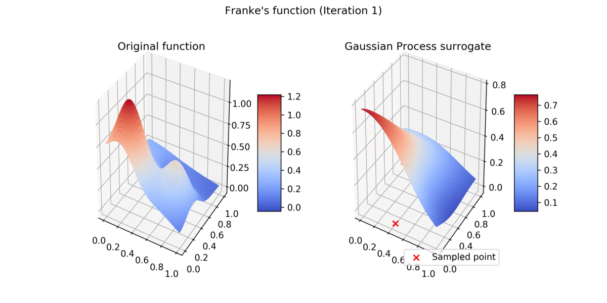

# Summary

Bayesian optimization has risen over the last few years as a very attractive method to optimize
expensive to evaluate, black box, derivative-free and possibly noisy functions [@Shahriari2016]. This framework uses _surrogate models_, such as the likes of a Gaussian Process [@Rasmussen2004] which describe a prior belief over the possible objective functions in order to approximate them. The procedure itself is inherently sequential: our function is first evaluated a few times, a surrogate model is then fit with this information, which will later suggest the next point to be evaluated according to a predefined _acquisition function_. These strategies typically aim to balance exploitation and exploration, that is, areas where the posterior mean or variance of our surrogate model are high respectively.

These strategies have recently grabbed the attention of machine learning researchers over simpler black-box optimization strategies, such as grid search or random search [@Bergstra2012]. It is specially interesting in areas such as automatic machine-learning hyperparameter optimization [@Snoek2012], A/B testing [@Chapelle2011] or recommender systems [@Vanchinathan2014], among others. Furthermore, the framework is entirely modular; there are many choices a user could take regarding the design of the optimization procedure: choice of surrogate model, covariance function, acquisition function behaviour or hyperparameter treatment, to name a few.

Here we present *pyGPGO* , an open-source Python package for Bayesian Optimization, which embraces this modularity in its design. While additional Python packages exist for the same purpose, either they are restricted for non-commercial applications [@SpearmingSnoek2012], implement a small subset of the features [@yelpmoe], or do not provide a modular interface [@scikitoptimize].  *pyGPGO* on the other hand aims to provide the highest degree of freedom in the design and inference of a Bayesian optimization pipeline, while being feature-wise competitive with other existing software. *pyGPGO* currently supports:

- Different surrogate models: Gaussian Processes, Student-t Processes, Random Forests (& variants)
  and Gradient Boosting Machines.
- Most usual covariance function structures, as well as their derivatives: squared exponential,
  Matèrn, gamma-exponential, rational-quadratic, exponential-sine and dot-product kernel.
- Several acquisition function behaviours: probability of improvement, expected improvement,
  upper confidence bound and entropy-based, as well as their integrated versions.
- Type II maximum-likelihood estimation of covariance hyperparameters.
- MCMC sampling for the full-bayesian treatment of hyperparameters (via `pyMC3` [@Salvatier2016])

*pyGPGO* is MIT-licensed and can be retrieved from both [GitHub](https://github.com/hawk31/pyGPGO)
and [PyPI](https://pypi.python.org/pypi/pyGPGO/0.3.0.dev1), with extensive documentation available at [ReadTheDocs](http://pygpgo.readthedocs.io/en/latest/).

# Future work

*pyGPGO* is an ongoing project, and as such there are several improvements that will be tackled
in the near future:

- Support for linear combinations of covariance functions, with automatic gradient computation.
- Support for more diverse acquisition functions, such as Predictive Entropy Search [@Hernandez-Lobato2014].
- A class for constrained Bayesian Optimization is planned for the near future. [@Gardner2014]
 

# References
